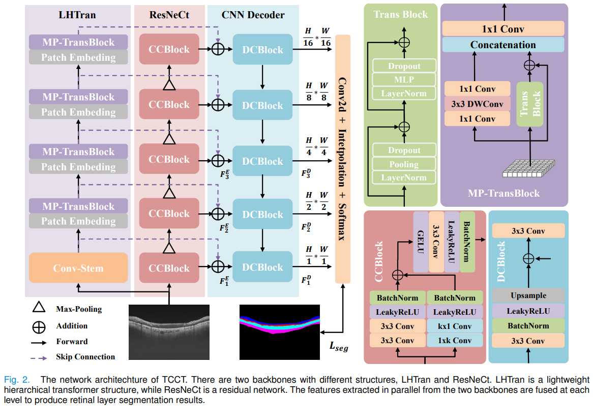
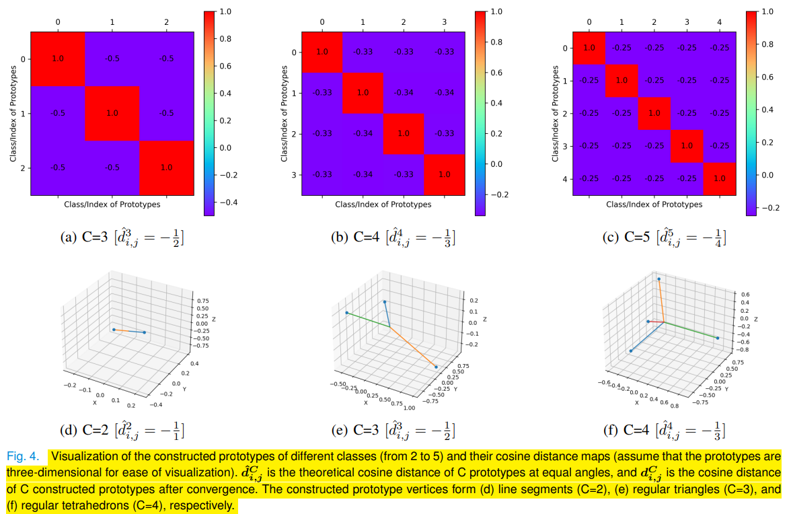
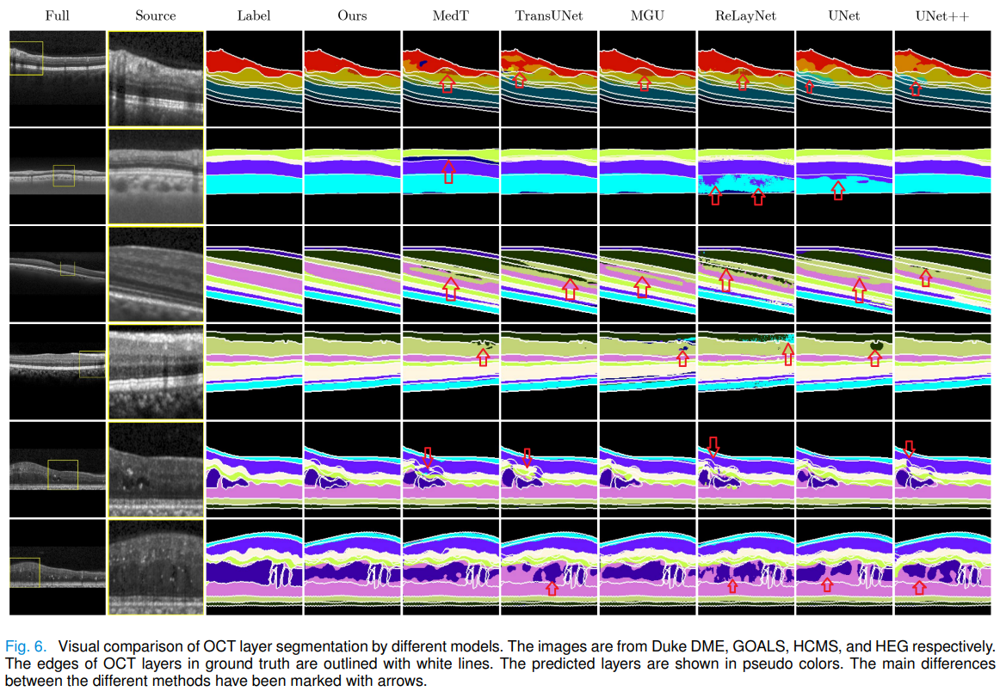

#   Solutions for MICCAI2022-GOALS@Baidu
-   MICCAI2022 Challenge: Glaucoma Oct Analysis and Layer Segmentation (GOALS)
-   GOALS Challenge:https://aistudio.baidu.com/aistudio/competition/detail/230/0/introduction
-   Implementation by PaddlePaddle/PyTorch
-   Pytorch implementation of the paper "[Retinal Layer Segmentation in OCT images with
Boundary Regression and Feature Polarization](https://ieeexplore.ieee.org/document/10255666)" (accepted by TMI2023).

The project's code is constantly being updated!

*   Network Structure


*   Feature Polarization


*   Visualization for Segmentation



## Prerequisites
* Python 3.8 
* Paddle 2.3.2
* Pytorch 1.13.0

##  Task1:Layer Segmentation
    Model:TCCT/PyTorch


```
Project for task1:Segmentation
    ├── data (code for datasets)
        ├── tran.py (some python imports)  
        ├── octnpy.py (parent class for OCT datasets)  
        ├── octgen.py (child class for OCT datasets)  
        └── ...  
    ├── kite (package for segmentation with torch)  
        ├── loop_seg.py (child class for training)  
        ├── loopback.py (parent class for training)  
        ├── main.py   
        └── ...  
    ├── nets (related models)  
        ├── fcp.py (Feature Polarization Loss - file1)  
        ├── fcs.py (Feature Polarization Loss - file2)  
        ├── reg.py (loss functions [feature polarization & boundary regression])  
        ├── tcct.py (Tightly combined Cross-Convolution and Transformer)  
        └── ...   
    ├── pnnx (trained weights)  
        ├── onnx.py (code to inference OCT images with *.onnx files)  
        └── ...   
```

And for the training on GOALS dataset, run the command
```bash
CUDA_VISIBLE_DEVICES=0 python kite/main.py --bs=8 --net=stc_tt --los=di --epochs=100 --db=goals
```
And for the training on HCMS dataset, run the command
```bash
CUDA_VISIBLE_DEVICES=1 python kite/main.py --bs=8 --net=stc_tt --los=di --epochs=100 --db=hcms
```


##  Citation
If you would like to use the code, please cite our work.
```
Y. Tan et al., "Retinal Layer Segmentation in OCT images with Boundary Regression and Feature Polarization," in IEEE Transactions on Medical Imaging, doi: 10.1109/TMI.2023.3317072.
```

```
@article{tan2023tcct,
  author={Tan, Yubo and Shen, Wen-Da and Wu, Ming-Yuan and Liu, Gui-Na and Zhao, Shi-Xuan and Chen, Yang and Yang, Kai-Fu and Li, Yong-Jie},
  journal={IEEE Transactions on Medical Imaging}, 
  title={Retinal Layer Segmentation in OCT images with Boundary Regression and Feature Polarization}, 
  year={2023},
  ISSN={1558-254X},
  doi={10.1109/TMI.2023.3317072},
  publisher={IEEE}
}
```

##  Task2:Glaucoma Classification
    Model:ResNet/Paddle
-   Training:       
    "python t2_train.py --gpu=0"
-   Ensemble:            
    "python t2_ensemble.py --root=xxx --gpu=0"


##  Contact
-   tyb311@qq.com
-   ybt@std.uestc.edu.cn